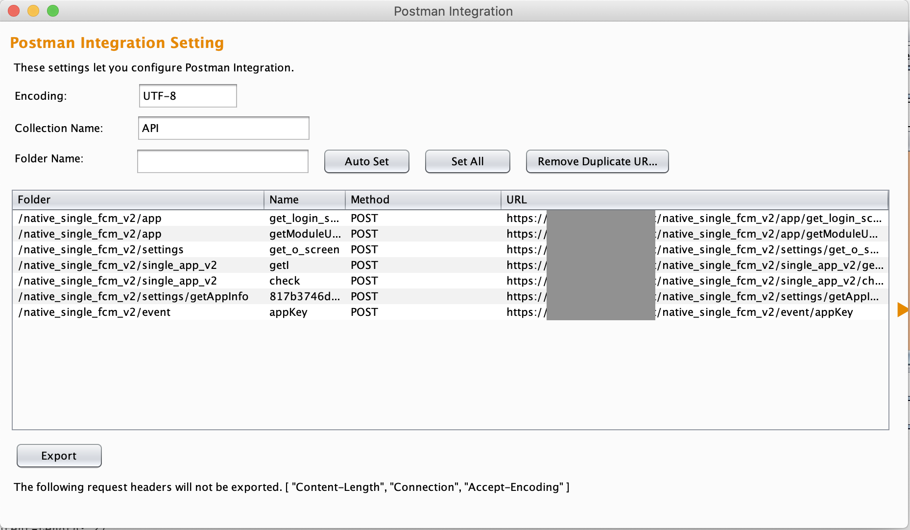

  

# Postman Integration
Postman Integration is an extension to generate **Postman Collection fomat json file**.

# 1.3 Update
- Auto Grouping based on URL Path using Auto SET Button
- Remove Duplicate URLs Button

# Usage

* It's very easy. You can open Postman Integration window from context menu "Export as Postman Collection" on history tab. Multiple selection is OK!. Then  set up the followings on the window.

  * **Encoding** - This is encoding.
  
  * **Collection Name**: - Collection name which you want to name in Postman.

  * **Folder Name**: - Folder name which you want to name in Postman. You may use "Set ALL" button to set folder name to the field "Folder" for all of requests.

  * **Name**: - Request name which you want to name in Postman.

* Once you press **Export** button, this generate Postman Collection format json file. **You can import it into Postman**.

## License
MIT
